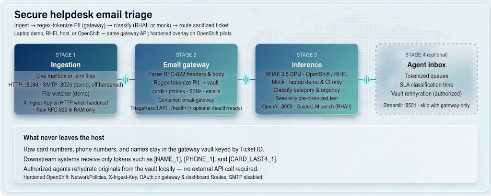

# Helpdesk email triage with tokenized PII

Classify support email by **category** and **urgency** while keeping raw PII out of logs, models, and downstream tools. Structured data (cards, phones, SSNs, emails, account IDs) is swapped for reversible tokens in a local vault before anything reaches inference.

**Customer evaluation** runs **Red Hat AI Inference (RHAII) 3.5 on CPU** — on OpenShift (Track 1) or a single RHEL host with systemd (Track 2). A **local mock stack** (Track 3) is for quick UI/CI checks without a cluster; it does not replace trying the real classifier.

**Authors:** Maryam Tahhan · Anton Ivanov · Michael Dawson

## Table of Contents

- [Overview](#overview)
  - [Who is this for?](#who-is-this-for)
  - [What this quickstart provides](#what-this-quickstart-provides)
  - [What you'll build](#what-youll-build)
  - [Key patterns you'll learn](#key-patterns-youll-learn)
  - [Architecture](#architecture)
- [Requirements](#requirements)
  - [Minimum hardware](#minimum-hardware)
  - [Minimum software](#minimum-software)
  - [Permissions](#permissions)
- [Choose your track](#choose-your-track)
- [Track 1: Deploy to OpenShift (RHAII CPU)](#track-1-deploy-to-openshift-rhaii-cpu)
  - [Submit support tickets](#submit-support-tickets)
  - [Review classified and redacted emails](#review-classified-and-redacted-emails)
  - [Review classification speed](#review-classification-speed)
  - [Testing classification and redaction quality](#testing-classification-and-redaction-quality)
  - [Load testing](#load-testing)
  - [What you've accomplished](#what-youve-accomplished)
- [Track 2: Run on RHEL with systemd (Quadlet)](#track-2-run-on-rhel-with-systemd-quadlet)
- [Track 3: Local mock validation (maintainers)](#track-3-local-mock-validation-maintainers)
- [Beyond the demo UI](#beyond-the-demo-ui)
- [OpenShift hardened pilot](#openshift-hardened-pilot)
- [Gateway API summary](#gateway-api-summary)
- [Configuration](#configuration)
- [Documentation](#documentation)
- [Development](#development)
- [Repository structure](#repository-structure)
- [References](#references)
- [Tags](#tags)

## Overview

### Who is this for?

**Platform engineers, AI engineers, and architects** who want to learn **CPU inference with [Red Hat AI Inference (RHAII) 3.5](https://docs.redhat.com/en/documentation/red_hat_ai_inference/3.5/html/getting_started/about-cpu-inference_getting-started)** on OpenShift or RHEL: pull and run an instruction-tuned model on **x86_64 + AVX512** (no GPU), wire an app to an OpenAI-compatible endpoint, observe readiness and latency, and optionally benchmark with GuideLLM.

The sample app is **helpdesk email triage** (ingest → tokenize PII → classify on sanitized text). That domain shows a realistic gateway in front of RHAII; integrators can use the API without the Streamlit inbox. **Track 3 (local mock)** is for UI/CI smoke tests only — it is not a substitute for trying RHAII.

### What this quickstart provides

A complete **ingest → vault tokenization → classification → ticket API** stack with sample support mail, an agent inbox, and OpenShift Kustomize overlays. The gateway (`email-gateway/`) is the reusable product; Streamlit is optional.

### What you'll build

By the end of the tracks below, you will have:

- An email gateway that ingests HTTP, SMTP (demo), or file-watched `.eml` drops
- Regex tokenization with a per-ticket PII vault (`[EMAIL_1]`, `[CARD_LAST4_1]`, `[ACCOUNT_ID_1]`, …)
- Category and urgency labels from **RHAII 3.5 CPU** (`Qwen/Qwen2.5-1.5B-Instruct` on tokenized text)
- An optional Streamlit inbox with queue filters, vault rehydration, and downstream JSON preview
- Optional GuideLLM benchmarking on OpenShift to size inference for a pilot
- Understanding of how to harden ingest auth on OpenShift overlays

### Key patterns you'll learn

| Pattern | What you'll see |
|---|---|
| **Structured PII tokenization** | Deterministic regex replaces cards, phones, SSNs, emails, `ACC-…` ids before model input |
| **Vault rehydration** | Original values keyed by ticket ID; gated by `VAULT_SECRET` |
| **Sanitized classification** | Inference sees tokenized body and subject only |
| **TriageResult contract** | Public ticket JSON excludes `original_text` and vault maps |
| **Multi-path ingest** | File watcher, JSON API, `.eml` upload, SMTP, sidebar scenarios |
| **Heuristic fallback** | Gateway still creates tickets if inference is down |
| **OpenShift overlays** | Mock vs RHAII CPU, optional hardened NetworkPolicies and API keys |

### Architecture



1. **Ingest** — HTTP `:8080`, SMTP `:3025` (demo), or file watcher on `.eml` drops.
2. **Gateway** — Tokenizes structured PII into a vault; exposes `TriageResult` JSON and `/health/ready`.
3. **Inference** — **RHAII 3.5 CPU** (customer tracks) or built-in mock (Track 3 / CI only). **Tokenized text only.**
4. **Agent inbox** *(optional)* — Streamlit on `:8501` (`/welcome` onboarding + inbox). Integrators can skip this.

**Privacy guarantee:** Raw card numbers, phones, and names do not reach the model. Downstream systems get tokens; authorized agents rehydrate locally.

## Requirements

### RHAII CPU hardware (Tracks 1 and 2)

Plan for **real** inference, not the mock:

| | OpenShift (Track 1) | RHEL host (Track 2) |
|---|---|---|
| **CPU** | **x86_64 + AVX512** on inference worker(s) | **x86_64 + AVX512** |
| **Memory** | **16 GiB+ allocatable RAM** on the inference node (**32 GiB recommended**) | **16 GiB+ system RAM** (**32 GiB recommended**) |
| **Storage** | `rhaii-model-cache` PVC for downloaded weights | `~/rhaii-cache` (or path in Quadlet unit) |
| **Registry** | `podman login registry.redhat.io` | Same |
| **Model access** | Hugging Face token (`HF_TOKEN` / `hf-secret`) | `HUGGING_FACE_HUB_TOKEN` in `secrets.env` |

First start downloads **Qwen2.5-1.5B-Instruct** weights — allow **several minutes** (longer on slow networks). No GPU required.

### Minimum software

- **Track 1:** `oc` CLI, OpenShift 5.x, `make`, `podman login registry.redhat.io`, `HF_TOKEN`
- **Track 2:** RHEL 9.4+ (including RHEL 10), `podman` and `make` from `dnf`, user systemd, registry login, Hugging Face token — **Quadlet does not need Compose**
- **Track 3 (optional):** `podman` or `docker` with Compose — on RHEL 10 install the Compose CLI with `sudo dnf install -y git python-pip` then `pip install podman-compose`; **no** registry or HF token for mock

### Permissions

- **Track 1:** Namespace admin (or equivalent) for Routes, Deployments, Secrets, PVCs
- **Track 2:** User systemd (`systemctl --user`); linger enabled if the host should survive logout
- **Track 3:** Local user only

## Choose your track

| | **Track 1: OpenShift** | **Track 2: RHEL Quadlet** | Track 3: Local mock |
|---|---|---|---|
| **Priority** | **Primary** — cluster deploy | **Primary** — single-host production style | Optional — maintainers / CI |
| **Goal** | Try the real stack on OpenShift | Try the real stack on RHEL + systemd | Validate UI and ingest without RHAII |
| **Time** | ~30–45 min (+ model download) | ~45 min (+ model download) | ~15 min |
| **Inference** | **RHAII 3.5 CPU** | **RHAII 3.5 CPU** | Mock only |
| **Start** | `INFERENCE=rhaii make deploy-openshift` | `make quadlet-deploy` (see [Track 2](#track-2-run-on-rhel-with-systemd-quadlet)) | `make demo` |
| **UI** | Dashboard Route `/welcome` | `http://127.0.0.1:8501/welcome` | `http://127.0.0.1:8501/welcome` |
| **GuideLLM** | `make guidellm-openshift` | `make guidellm-quadlet` | — (mock; skip) |

**Customers:** deploy with **Track 1** or **Track 2**, then work through the **hands-on checklist** in Track 1 ([Submit support tickets](#submit-support-tickets) → [What you've accomplished](#what-youve-accomplished)) before tear-down. **Track 3** is mock-only smoke / CI.

---

## Track 1: Deploy to OpenShift (RHAII CPU)

*~30–45 minutes. **Recommended customer path** — Routes, RHAII 3.5 CPU, optional GuideLLM.*

### Prerequisites

- `oc` logged into a cluster that meets the [RHAII CPU hardware](#rhaii-cpu-hardware-tracks-1-and-2) requirements
- `git`, `make`, `curl`, `python3`
- `export HF_TOKEN="your_huggingface_token"`
- `podman login registry.redhat.io`

### Step 1: Deploy with RHAII CPU

```bash
git clone <repo-url> && cd helpdesk-email-triage
oc new-project helpdesk-email-triage    # once
export HF_TOKEN="your_huggingface_token"
podman login registry.redhat.io
INFERENCE=rhaii make deploy-openshift
```

Weights download to the `rhaii-model-cache` PVC on first start. Increase wait if needed: `RHAII_WAIT_TIMEOUT=1200s INFERENCE=rhaii make deploy-openshift`.

<details>
<summary>Mock on OpenShift (smoke only — not a customer evaluation)</summary>

Use when the cluster cannot run RHAII yet, or for overlay/CI checks:

```bash
INFERENCE=mock make deploy-openshift
```

The inbox welcome pill shows **local mock**. For full UI regression without a cluster, prefer [Track 3](#track-3-local-mock-validation-maintainers).
</details>

### Step 2: Verify deployment

```bash
make verify-openshift
```

You should see **Gateway** and **Dashboard** Route URLs, gateway `/health` JSON (with a real model name when RHAII is up), dashboard headers, and at least one ticket.

Open **`https://<dashboard-route>/welcome`** — the pill should show **RHAII**, not mock.

If the gateway Route is OAuth-protected (hardened overlay), verify uses in-cluster port-forward for API smoke tests — follow the script output.

Save your **dashboard** URL (`https://<dashboard-route>/welcome`) and **gateway** URL (`https://<gateway-route-host>`) for the steps below. Vault rehydration uses `VAULT_SECRET` from `helpdesk-secrets` (not the laptop demo default).

### Submit support tickets

Try each ingest path at least once on the cluster:

| Method | How |
|---|---|
| **File watcher** | Sample `.eml` files in `sample_emails/` ingest on deploy (if mounted) |
| **Sidebar scenarios** | On the dashboard Route → **Quick demo scenario** (billing, MFA, VPN, …) |
| **Custom message** | Sidebar form → **Triage →** |
| **HTTP API** | `POST /ingest/raw` or upload `.eml` via `POST /ingest` ([integration.md](docs/integration.md)) |
| **SMTP** | Sidebar **↪** or mail to `support@helpdesk.local` when SMTP is exposed on the overlay |

```bash
GW="https://<gateway-route-host>"
curl -sk -X POST "${GW}/ingest/raw" \
  -H "Content-Type: application/json" \
  -d '{"sender":"you@example.com","subject":"VPN issue","body":"Cannot connect from home office."}'
```

When `INGEST_API_KEY` is set (hardened overlay), add `-H "X-Ingest-Key: …"` from `oc get secret helpdesk-secrets -n helpdesk-email-triage -o jsonpath='{.data.INGEST_API_KEY}' | base64 -d`.

**What to look for:** New tickets in the inbox queue within a few seconds.

### Review classified and redacted emails

#### Step 1: Review the email in the different inboxes based on classification

1. On the dashboard, set **Queue** to each category: `Billing`, `Tech Support`, `Account Access`, `General`, then `All`.
2. Set **Urgency** to `High` — urgent samples (double charge, MFA lockout) should surface first.
3. Click tickets in the left **Queue** column; detail opens with **category**, **urgency**, and subject.
4. Expand **Category breakdown** above the queue.

Expected sample results (file-watcher emails):

| Email | Category | Urgency |
|---|---|---|
| Double charge on card | Billing | High |
| MFA lockout | Account Access | High |
| VPN dropping | Tech Support | Medium |
| GDPR erasure request | General | Low |

#### Step 2: Check redaction

1. Open a ticket with obvious PII (e.g. billing double-charge).
2. In **Sanitized body**, confirm tokens (`[NAME_1]`, `[EMAIL_1]`, `[CARD_LAST4_1]`, `[PHONE_1]`, `[ACCOUNT_ID_1]` for `ACC-…`) — not raw values. **From** on the ticket should be tokenized.
3. Click **View original PII vault** — compare the token map to the original body.
4. Expand **What downstream systems see** — exact `GET /tickets/{id}` JSON for webhooks/CRMs; no `original_text` or vault map.

### Review classification speed

1. In the queue list, each ticket shows **classification time** (e.g. `42 ms classification` on mock; higher on RHAII CPU).
2. At the top of the inbox, check **Avg classification** in the metrics row.
3. In ticket detail, note the per-ticket latency tag next to the timestamp.

```bash
# Optional — use gateway Route or in-cluster URL from verify port-forward
curl -sk "${GW}/tickets" | python3 -c \
  'import json,sys; t=json.load(sys.stdin); print([(x["id"], x.get("classification_ms")) for x in t[:5]])'
```

### Testing classification and redaction quality

1. **Custom PII patterns** — submit a message with a card number, phone, email, and `ACC-12345` account id; verify distinct tokens in the sanitized body and vault map.
2. **Category sanity** — billing language → `Billing`; access/MFA → `Account Access`; VPN/outage → `Tech Support`.
3. **Residual names** — RHAII may add `[NAME_N]` tokens; the gateway merge step rejects model output that drops structured tokens or reintroduces raw PII.
4. **Heuristic fallback** — scale inference to zero (`oc scale deployment/rhaii-cpu -n helpdesk-email-triage --replicas=0`); ingest still works and `model` shows `heuristic-fallback`. Scale back up when finished.
5. **Regression** — run `make test` on a workstation for automated API and pipeline checks.

More UI detail: [docs/testing-locally.md](docs/testing-locally.md).

### Load testing

**Canonical GuideLLM guide** for Track 1 (OpenShift) and Track 2 (RHEL Quadlet). Load-test the **RHAII inference endpoint** (OpenAI-compatible `:8000`) with [GuideLLM](https://github.com/vllm-project/guidellm) — the same class of call the gateway makes on tokenized text. Skip on mock-only deploys. Maintainer functional/E2E automation is separate: [docs/testing/README.md](docs/testing/README.md).

For end-to-end **gateway** load, run parallel `POST /ingest/raw` against the gateway Route (include `X-Ingest-Key` when configured).

#### Step 1: Install GuideLLM

**OpenShift (recommended)** — the benchmark Job uses the Red Hat image (same registry login as RHAII CPU):

```bash
podman login registry.redhat.io
# Default at Job runtime: registry.redhat.io/rhai/guidellm-rhel9
```

**RHEL / Quadlet (Track 2)** — same Red Hat image as OpenShift (`guidellm run`, not upstream `benchmark run`):

```bash
podman login registry.redhat.io
podman pull registry.redhat.io/rhai/guidellm-rhel9:3.5.0-1787154406
```

#### Step 2: Run load test

**OpenShift** — requires `rhaii-cpu` in the namespace:

```bash
make guidellm-openshift
# Optional: GUIDELLM_RATE=1,2,4 GUIDELLM_MAX_SECONDS=300 make guidellm-openshift
```

Benchmarks via in-cluster Service DNS (`rhaii-cpu:8000`), not the public Route. Artifacts copy to `./results/guidellm-openshift/`. Follow logs with the Job name printed by the script:

```bash
oc logs -n helpdesk-email-triage job/guidellm-benchmark-<timestamp> --follow
```

**RHEL / Quadlet** — with RHAII on `127.0.0.1:8000` (after `make quadlet-up`):

```bash
make guidellm-quadlet
# Optional: GUIDELLM_RATE=1,2,4 GUIDELLM_MAX_SECONDS=300 make guidellm-quadlet
```

Same image and `guidellm run` CLI as OpenShift (`registry.redhat.io/rhai/guidellm-rhel9:3.5.0-1787154406`). Results under `./results/guidellm-quadlet/`; token from `~/.config/helpdesk/secrets.env`. Alternative target on the Podman network: `GUIDELLM_PODMAN_NETWORK=helpdesk GUIDELLM_TARGET=http://rhaii-cpu-engine:8000 make guidellm-quadlet`.

Extended runbook: [docs/deploy-openshift.md](docs/deploy-openshift.md#load-test-inference-guidellm).

#### Step 3: Review results

- **Console** — throughput and latency in Job logs (`oc logs …`) or `podman run` stdout.
- **HTML** — open `./results/guidellm-openshift/*.html` or `./results/guidellm-quadlet/benchmark-results.html` in a browser.
- **JSON** — archive or compare runs under `./results/guidellm-openshift/` or `./results/guidellm-quadlet/`.

Use the numbers to size RHAII CPU nodes before a pilot.

### What you've accomplished

- Deployed a **helpdesk triage pipeline** on OpenShift (ingest → tokenize → RHAII classify → ticket API).
- Submitted mail via **multiple ingest paths** and confirmed tickets in the agent inbox.
- Verified **category and urgency** and filtered the queue by classification.
- Confirmed **PII redaction** (including sender and `ACC-…` account ids) in downstream JSON while retaining authorized vault rehydration.
- Observed **classification latency** per ticket and in aggregate.
- Optionally **benchmarked inference** with GuideLLM on RHAII CPU.

### Delete

```bash
make undeploy-openshift
# Remove the whole project:
DELETE_NAMESPACE=1 make undeploy-openshift
```

Full overlay catalog: [docs/deploy-openshift.md](docs/deploy-openshift.md).

---

## Track 2: Run on RHEL with systemd (Quadlet)

*~45 minutes. **Recommended for single-host evaluation** — RHAII 3.5 CPU via user systemd, optional [GuideLLM](#load-testing).*

### Prerequisites

- RHEL 9.4+ (including **RHEL 10**) with rootless Podman meeting [RHAII CPU hardware](#rhaii-cpu-hardware-tracks-1-and-2) requirements
- **Podman** and **make** from `dnf` (`sudo dnf install -y podman make` on minimal hosts). Quadlet ships with Podman — **you do not need Compose for this track**
- **Compose (optional)** — only for [Track 3](#track-3-local-mock-validation-maintainers) or [Compose on RHEL](#production-rhel-with-compose) on the same host. On RHEL 10 when `podman compose` is unavailable: `sudo dnf install -y python3-pip` then `pip install --user podman-compose` (add `~/.local/bin` to `PATH`)
- `podman login registry.redhat.io`
- Hugging Face token and a strong `VAULT_SECRET`

### Step 1: One-time setup (repo root)

```bash
mkdir -p ~/.config/containers/systemd ~/.config/helpdesk \
  ~/helpdesk/sample_emails ~/helpdesk/docs ~/rhaii-cache

cat > ~/.config/helpdesk/secrets.env <<'EOF'
HUGGING_FACE_HUB_TOKEN=hf_your_token_here
VAULT_SECRET=change-me-before-deploy
EOF
chmod 600 ~/.config/helpdesk/secrets.env

podman login registry.redhat.io
cp -r sample_emails/. ~/helpdesk/sample_emails/
cp -r docs/. ~/helpdesk/docs/
```

### Step 2: Build images

Gateway and UI `Containerfile`s expect **repo root** as build context:

```bash
podman build -f email-gateway/Containerfile -t localhost/helpdesk-email-gateway:prod .
podman build -f agent-dashboard/Containerfile -t localhost/helpdesk-triage-ui:prod .
```

### Step 3: Install Quadlet units and start

```bash
cp deploy/quadlet/*.container deploy/quadlet/*.network deploy/quadlet/*.volume \
   ~/.config/containers/systemd/

systemctl --user daemon-reload
systemctl --user start rhaii-cpu-engine.service email-gateway.service agent-dashboard.service
```

Quadlet units show as **`generated`** in `systemctl --user list-unit-files`. Do **not** use `systemctl --user enable` if systemd reports *transient or generated* — use **`start`** above, then for boot / after SSH logout:

```bash
sudo loginctl enable-linger "$USER"
systemctl --user add-wants default.target \
  rhaii-cpu-engine.service email-gateway.service agent-dashboard.service
```

Watch RHAII come up (first start downloads weights). If `journalctl --user` prints **No journal files were found**, use **Podman logs** (always works) or enable linger and open a new SSH session:

```bash
podman logs -f rhaii-cpu-engine
# or, once user journal exists:
journalctl --user -u rhaii-cpu-engine.service -f
```

### Step 4: Verify

```bash
systemctl --user status rhaii-cpu-engine email-gateway agent-dashboard
podman ps --format "table {{.Names}}\t{{.Status}}\t{{.Ports}}"
curl -sS http://127.0.0.1:8080/health
curl -sS http://127.0.0.1:8080/health/ready
curl -sS http://127.0.0.1:8080/tickets | python3 -m json.tool | head -20
curl -sI http://127.0.0.1:8501/welcome | head -5
```

Open **[http://127.0.0.1:8501/welcome](http://127.0.0.1:8501/welcome)** — pill should reflect **RHAII**, not mock. From a laptop, SSH port-forward: `ssh -L 8501:127.0.0.1:8501 -L 8080:127.0.0.1:8080 ec2-user@<host>`.

**Troubleshooting:** If `rhaii-cpu-engine` is `activating (auto-restart)` and `curl …/health` shows `"classify_model":""`, run `podman logs rhaii-cpu-engine --tail 80` (not only `journalctl --user`, which may print *No journal files were found* until linger is enabled). Check `HUGGING_FACE_HUB_TOKEN` in `secrets.env`, registry login, and **≥16 GiB RAM**. After updating `deploy/quadlet/rhaii-cpu-engine.container`, `cp` it again and `systemctl --user daemon-reload && systemctl --user restart rhaii-cpu-engine`. Details: [deploy/quadlet/README.md](deploy/quadlet/README.md).

### Step 5: Hands-on validation (same checklist as Track 1)

Work through **[Submit support tickets](#submit-support-tickets)** through **[What you've accomplished](#what-youve-accomplished)** in Track 1, using this host instead of OpenShift Routes:

| | RHEL / Quadlet |
|---|---|
| **Welcome / inbox** | `http://127.0.0.1:8501/welcome` |
| **Gateway API** | `http://127.0.0.1:8080` |
| **Vault secret** | `VAULT_SECRET` in `~/.config/helpdesk/secrets.env` |
| **GuideLLM target** | `http://127.0.0.1:8000` — see [Load testing → Step 2](#step-2-run-load-test) (RHEL / Quadlet) |

Optional extra ingest:

```bash
./scripts/ingest-sample.sh
```

### Stop

```bash
systemctl --user stop agent-dashboard email-gateway rhaii-cpu-engine
```

**Compose alternative** on RHEL (no systemd): see [Production RHEL with Compose](#production-rhel-with-compose) below. Full Quadlet notes: [deploy/quadlet/README.md](deploy/quadlet/README.md).

---

## Track 3: Local mock validation (maintainers)

*~15 minutes. **Not a customer evaluation path** — mock classifier, no registry or HF token. Use for UI smoke tests, docs screenshots, and `make compose-e2e` / CI.*

### Prerequisites

- `podman` or `docker` with Compose, `make`, `curl`, `python3`

### Step 1: Start the mock stack

```bash
git clone <repo-url> && cd helpdesk-email-triage
make demo
```

Gateway `:8080`, dashboard `:8501`, SMTP `:3025`. Sample mail ingests automatically. Welcome pill shows **local mock**.

```bash
curl -sS http://127.0.0.1:8080/health   # classify_model: mock-triage
```

### Step 2: Smoke-test the inbox

Walk the Track 1 checklist ([Submit support tickets](#submit-support-tickets) through redaction) at `http://127.0.0.1:8501`. Vault demo secret: `helpdesk-demo-secret`. Skip [Load testing](#load-testing) unless you run `compose.yml` with RHAII.

Optional maintainer checks: stop mock inference (`podman stop helpdesk-inference-mock`) and confirm **heuristic-fallback** ingest.

```bash
make down
```

---

## Beyond the demo UI

### Integrators (gateway only)

```bash
make gateway-only
```

No Streamlit — mock inference + gateway only. Wire your queue via [docs/integration.md](docs/integration.md) (`POST /ingest`, webhooks, `TICKET_SINK`).

### Production RHEL with Compose

```bash
cp .env.example .env
podman login registry.redhat.io
export HF_TOKEN="your_huggingface_token"
export RHEL_CACHE_DIR="$HOME/rhaii-cache" && mkdir -p "$RHEL_CACHE_DIR"
podman compose -f compose.yml up --build -d
```

Open [http://127.0.0.1:8501/welcome](http://127.0.0.1:8501/welcome). Prefer Quadlet when you need boot integration and `journalctl` per service.

### Demo UI deep dive

Every sidebar control: [docs/testing-locally.md](docs/testing-locally.md).

---

## OpenShift hardened pilot

NetworkPolicies, OAuth on Routes, non-demo secrets:

```bash
export VAULT_SECRET="$(openssl rand -hex 32)"
export INGEST_API_KEY="$(openssl rand -hex 16)"
oc create secret generic helpdesk-secrets \
  --from-literal=VAULT_SECRET="$VAULT_SECRET" \
  --from-literal=INGEST_API_KEY="$INGEST_API_KEY" \
  -n helpdesk-email-triage --dry-run=client -o yaml | oc apply -f -

# RHAII CPU + hardening (recommended pilot):
INFERENCE=rhaii OVERLAY=deploy/openshift/overlays/hardened make deploy-openshift

# Mock + hardening (overlay smoke only):
OVERLAY=deploy/openshift/overlays/hardened INFERENCE=mock make deploy-openshift
```

> `OVERLAY=.../hardened` without `INFERENCE=rhaii` deploys **mock** inference.

HTTP ingest then requires `X-Ingest-Key`. Pin images: `IMAGE_TAG=v1.2.3 make deploy-openshift`.

---

## Gateway API summary

The reusable product is `email-gateway/` — Streamlit is optional.

| Endpoint | Purpose |
|---|---|
| `GET /health` | Liveness |
| `GET /health/ready` | Readiness (inference reachable) |
| `POST /ingest` | Upload `.eml` |
| `POST /ingest/raw` | JSON `{sender, subject, body}` |
| `GET /tickets` | List tickets (`X-Ingest-Key` when configured) |
| `GET /tickets/{id}` | Single ticket |
| `GET /tickets/{id}/vault` | Rehydrate PII — `X-Vault-Secret` or `X-Ingest-Key` |

**Ports:** HTTP `8080` · SMTP `3025` · inference `8000` · dashboard `8501`

Full reference: [docs/integration.md](docs/integration.md)

---

## Configuration

Copy defaults: `cp .env.example .env`

| Variable | What it does |
|---|---|
| `VAULT_SECRET` | Gates vault rehydration |
| `INGEST_API_KEY` | Requires `X-Ingest-Key` on ingest and ticket APIs when set |
| `MODEL_NAME` | `Qwen/Qwen2.5-1.5B-Instruct` (RHAII) or `mock-triage` (demo) |
| `HF_TOKEN` | Hugging Face token for RHAII |
| `INFERENCE` | OpenShift: default `rhaii`; or `mock`, `auto` |
| `IMAGE_TAG` | Pin container tags on OpenShift deploy |
| `TICKET_SINK` | `webhook:https://…` or `log` |
| `TICKET_SINK_MAX_WORKERS` | Async webhook pool size (default `4`) |

See `.env.example` for the full list.

---

## Documentation

| Guide | When to read it |
|---|---|
| [docs/quickstart-walkthrough.md](docs/quickstart-walkthrough.md) | Mirror of Track 1 hands-on sections for deep links |
| [docs/testing-locally.md](docs/testing-locally.md) | Every demo UI feature |
| [docs/integration.md](docs/integration.md) | HTTP/SMTP API, auth, webhooks |
| [docs/deploy-openshift.md](docs/deploy-openshift.md) | Overlays, verify, production checklist |
| [docs/customer-ci.md](docs/customer-ci.md) | Fork, Quay publish, pipeline adoption |
| [deploy/openshift/README.md](deploy/openshift/README.md) | Kustomize layout |
| [deploy/quadlet/README.md](deploy/quadlet/README.md) | Quadlet units |
| [docs/testing/README.md](docs/testing/README.md) | Functional / E2E regression (maintainers; GuideLLM stays in this README) |

---

## Development

```bash
make test              # unit tests (no running stack)
make lint
make compose-e2e       # mock gateway stack smoke test
make validate-manifests
make test-openshift-overlay
make build-images
```

**GuideLLM** (inference benchmarking): [Load testing](#load-testing) above.

**Functional / E2E regression** (maintainers): [docs/testing/README.md](docs/testing/README.md).

**CI** (on every PR): ruff, tests, compose e2e, kind e2e, container builds (mock inference only).

**Published images:** `quay.io/mtahhan/helpdesk-email-gateway`, `helpdesk-triage-ui`, `helpdesk-inference-mock`.

---

## Repository structure

```
.
├── email-gateway/          # API, SMTP, tokenization, vault
├── agent-dashboard/        # Streamlit inbox + welcome page
├── inference-mock/         # OpenAI-compatible mock for laptop/CI
├── sample_emails/          # Demo .eml (fictional PII)
├── compose*.yml            # Laptop / RHEL stacks
├── deploy/openshift/       # Kustomize overlays
├── deploy/quadlet/         # systemd Quadlet units
└── scripts/                # deploy, verify, ingest helpers
```

---

## References

- [Red Hat AI Inference 3.5 — CPU inference](https://docs.redhat.com/en/documentation/red_hat_ai_inference/3.5/html/getting_started/about-cpu-inference_getting-started)
- [AI quickstart catalog](https://docs.redhat.com/en/learn/ai-quickstarts)
- [Qwen2.5-1.5B-Instruct](https://huggingface.co/Qwen/Qwen2.5-1.5B-Instruct)
- [GuideLLM](https://github.com/vllm-project/guidellm)

---

## Tags

`helpdesk` `email` `triage` `pii` `tokenization` `red-hat-ai-inference` `openshift` `rhel` `streamlit` `quickstart`
