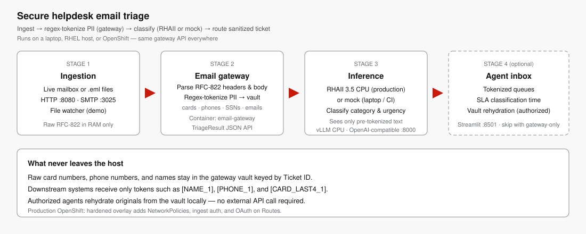

# Triage support email with tokenized PII on RHEL

Ingest customer support emails on RHEL, classify topic and urgency, and replace PII with reversible tokens using Red Hat AI Inference on CPU.

**Authors:**
- Michael Dawson ([midawson@redhat.com](mailto:midawson@redhat.com))
- Maryam Tahhan ([mtahhan@redhat.com](mailto:mtahhan@redhat.com))
- Anton Ivanov ([anivanov@redhat.com](mailto:anivanov@redhat.com))

## Table of Contents

- [Overview](#overview)
- [Detailed description](#detailed-description)
  - [See it in action](#see-it-in-action)
  - [Architecture diagrams](#architecture-diagrams)
- [Requirements](#requirements)
  - [Minimum hardware requirements](#minimum-hardware-requirements)
  - [Minimum software requirements](#minimum-software-requirements)
  - [Required user permissions](#required-user-permissions)
- [Deploy](#deploy)
  - [Prerequisites](#prerequisites)
  - [Installation](#installation)
  - [Validating the deployment](#validating-the-deployment)
  - [Delete](#delete)
- [Repository structure](#repository-structure)
- [References](#references)
- [Technical details](#technical-details)
- [Authors](#authors)
- [Tags](#tags)

## Overview

Helpdesk and customer-support teams receive unstructured email that mixes billing disputes, access lockouts, and technical failures with credit-card numbers, phone numbers, and names. This quickstart shows how to triage that mail on existing CPU infrastructure: ingest a message, classify topic and urgency, replace personally identifiable information with reversible tokens, and present a sanitized inbox to an agent.

After you deploy it, you can drop a `.eml` file (or send SMTP to port 3025), watch a ticket appear in a Streamlit inbox under Billing, Tech Support, Account Access, or General, and rehydrate the original PII only for an authorized view tied to the ticket ID.

## Detailed description

Enterprises must route support mail quickly without sending raw card numbers, phone numbers, or names into downstream logs, cloud queues, or lower-tier tools. Regulations such as GDPR, HIPAA, and GLBA make that split explicit: automation can see a token; only the agent of record should see the customer.

This AI quickstart deploys a three-service Podman Compose stack on Red Hat Enterprise Linux. An email gateway holds the original RFC-822 payload in memory, writes structured tokens such as `[NAME_1]`, `[PHONE_1]`, and `[CARD_LAST4_1]` into a local vault, and asks Red Hat AI Inference 3.5 (vLLM on CPU) for category, urgency, and remaining name redaction. A Streamlit dashboard then shows tokenized queues with `X-Classification-Time` SLA tags. No GPU is required.

Use it as a pattern for on-premise helpdesk automation: keep inference on the same host as the mailbox, give downstream systems only sanitized text, and let an authorized representative recover the original metadata from the ticket vault.

### See it in action

After the stack is up, the dashboard opens automatically (local script) or navigate to [http://127.0.0.1:8501](http://127.0.0.1:8501).

Seven **quick demo scenario** buttons in the sidebar let you triage a pre-built email instantly — a billing double-charge, an MFA lockout, a VPN failure, a healthcare ER bill, an HR payroll dispute, a GDPR erasure request, and a low-urgency thank-you note — without touching the command line. Each submission classifies the email, replaces PII with structured tokens (`[NAME_1]`, `[CARD_LAST4_1]`, `[PHONE_1]`), and adds a ticket to the queue within a couple of seconds.

The sample `.eml` files in `sample_emails/` are also ingested automatically by the file watcher when the stack starts. The queue refreshes every 10 seconds without a browser reload.

Category, urgency, and sanitized text are labeled **AI-generated** in the UI; verify them before you route a real ticket.

### Architecture diagrams



| Stage | Component | What it does |
|---|---|---|
| 1 — Ingestion | SMTP listener / file watcher | Accepts RFC-822 email from a mailbox or `.eml` drop |
| 2 — Email gateway | `email-gateway` container | Parses headers and body; **regex-tokenizes PII** (cards, phones, SSNs, emails, account IDs) into a local vault keyed by ticket ID; the original sender address and contact details are stored in that vault under the same ticket ID |
| 3 — Local CPU AI | Red Hat AI Inference 3.5 (vLLM CPU) | Acts as a **stateless preprocessing node**: receives pre-sanitized text (tokens only, never raw PII) and returns `category`, `urgency`, and any residual name redaction. The sanitized output is safe to route to secondary tiers, cloud-based analytics, or lower-trust queues without leaking PII across compliance boundaries |
| 4 — Agent inbox | Streamlit dashboard | Displays tokenized queues. The **ticket ID** is the secure link back to all original contact details in the vault (and, in enterprise deployments, to the CRM record in Salesforce, ServiceNow, etc.). Authorized agents rehydrate the original body and sender details through the vault — downstream systems never see raw PII |

**How an agent knows who to respond to:** The sanitized body is intentionally stripped of identifying details so it can flow through untrusted channels. The agent does not read the sender from the sanitized text — they read it from the ticket envelope (the `From:` header stored in the vault under the ticket ID). In an enterprise pipeline, the ticket ID maps directly to a CRM record that already holds the customer's contact details. Tokenization (`[NAME_1]`, `[PHONE_1]`) rather than total deletion means authorized agents can re-attach the original values from the vault without the raw data ever appearing in downstream logs.

Support mail never has to leave the host. The email gateway holds all raw PII in a vault keyed by ticket ID. Downstream systems — including RHAII — receive only tokenized text. Authorized agents can open the original body and contact details from that vault.

## Requirements

### Minimum hardware requirements

**Demo path (mock inference, laptop or RHEL):**
- CPU: 2 vCPU
- Memory: 4 GiB
- Storage: 2 GiB
- Architecture: x86_64 or aarch64

**Application (email gateway + Streamlit UI):**
- CPU: 1 vCPU
- Memory: 1 GiB

**Red Hat AI Inference 3.5 CPU engine with `Qwen/Qwen2.5-1.5B-Instruct` (default):**
- CPU: 8 vCPU (Intel Xeon or AMD EPYC with AVX2 minimum; AVX-512 or Intel AMX preferred)
- Memory: 16 GiB (32 GiB recommended)
- Storage: 20 GiB for the model cache
- Architecture: x86_64 only

**Optional larger model `Qwen/Qwen2.5-7B-Instruct`:**
- CPU: 16 vCPU or more
- Memory: 32 GiB or more
- `VLLM_CPU_KVCACHE_SPACE=10` or higher

CPU inference is intended for smaller models. For high throughput or models above a few billion parameters, use GPU-backed Red Hat AI Inference instead.

### Minimum software requirements

- Red Hat Enterprise Linux 9.4 or later (x86_64) for the Red Hat AI Inference path
- Podman 4.9 or later with the Compose plugin (`podman compose`)
- Red Hat AI Inference 3.5 CPU container image (`registry.redhat.io/rhaii/vllm-cpu-rhel9:3.5.0-1786546771`)
- A Hugging Face account and access token (to download the instruct model)
- Python 3.11 or later (only for the local no-container demo)

The demo compose file (`compose.mock.demo.yml`) runs a mock OpenAI-compatible endpoint instead of the Red Hat AI Inference image, so you can exercise the gateway and UI without `registry.redhat.io`.

### Required user permissions

A regular local user can deploy this quickstart with rootless Podman. You need:

- Permission to run Podman and bind to ports 8000, 3025, 8080, and 8501
- Permission to log in to `registry.redhat.io` (Red Hat AI Inference path only)
- No cluster-admin or root access beyond what your site already uses for Podman

## Deploy

### Prerequisites

1. Clone this repository.
2. For the Red Hat AI Inference path, log in to the registry and export a Hugging Face token:

```bash
podman login registry.redhat.io
export HF_TOKEN="your_huggingface_token"
export RHEL_CACHE_DIR="$HOME/rhaii-cache"
mkdir -p "$RHEL_CACHE_DIR"
```

3. Copy the example environment file:

```bash
cp .env.example .env
```

### Installation

**Option A — Demo stack (mock inference)**

Use this to walk the UI and tokenization flow on a laptop:

```bash
podman compose -f compose.mock.demo.yml up --build
```

Without Podman, from the repository root:

```bash
chmod +x scripts/run-demo-local.sh
./scripts/run-demo-local.sh
```

**Option B — Red Hat AI Inference 3.5 on RHEL CPUs**

```bash
podman compose -f compose.yml up --build -d
```

To serve the larger 7B instruct model on a well-provisioned host:

```bash
MODEL_NAME=Qwen/Qwen2.5-7B-Instruct VLLM_CPU_KVCACHE_SPACE=10 \
  podman compose -f compose.yml up --build -d
```

The first start downloads model weights into `RHEL_CACHE_DIR` and can take several minutes.

### Validating the deployment

1. Confirm the three containers are running:

```bash
podman compose -f compose.mock.demo.yml ps
```

2. Check gateway health:

```bash
curl -sS http://127.0.0.1:8080/health
```

3. Open the agent inbox at [http://127.0.0.1:8501](http://127.0.0.1:8501). You should see tickets from `sample_emails/` with AI-generated category and urgency labels and a sanitized body that uses tokens instead of raw card and phone values.

4. Optional: ingest another sample over HTTP:

```bash
./scripts/ingest-sample.sh
```

5. Optional: send a message to the mock SMTP listener on port 3025.

### Delete

```bash
podman compose -f compose.yml down -v
podman compose -f compose.mock.demo.yml down -v
```

Local demo processes started by `scripts/run-demo-local.sh` stop when you interrupt that script (Ctrl+C). You can also remove `./data` and `./.venv`.

## Repository structure

```
.
├── compose.yml                 # Red Hat AI Inference 3.5 + gateway + UI
├── compose.mock.demo.yml            # Mock inference + gateway + UI
├── email-gateway/              # SMTP/file ingest, tokenization, ticket API
│   └── gateways/               # Reused vLLM MIME filter (stdin/stdout)
├── agent-dashboard/            # Streamlit helpdesk inbox
├── inference-mock/             # OpenAI-compatible mock for laptops
├── sample_emails/              # RFC-822 examples with fictional PII
├── scripts/                    # Local demo and ingest helpers
├── docs/images/                # Architecture diagram
└── README.md
```

## References

- [Inference language models on x86_64 CPUs — Red Hat AI Inference 3.5](https://docs.redhat.com/en/documentation/red_hat_ai_inference/3.5/html/getting_started/about-cpu-inference_getting-started)
- [AI quickstart catalog](https://docs.redhat.com/en/learn/ai-quickstarts)
- [Contributor guide for AI quickstarts](https://github.com/rh-ai-quickstart/ai-quickstart-contrib/blob/main/CONTRIBUTING.md)
- [Qwen2.5 on Hugging Face](https://huggingface.co/Qwen/Qwen2.5-1.5B-Instruct)

## Technical details

Classification uses the vLLM email gateway from `email-gateway/gateways/email_classification_gateway.py`. That filter is adapted from Anton Ivanov's email classification gateway in `redhat-et/vllm-audio-demo`: it parses RFC-822, sends the `text/plain` body to an OpenAI-compatible endpoint (`responses.create`, with a `chat.completions` fallback), and expects JSON with `category`, `urgency`, and `sanitized_text`. You can still run it as a drop-in mail filter:

```bash
python email-gateway/gateways/email_classification_gateway.py \
  --config email-gateway/vllm-email-gw.json \
  --file sample_emails/01-billing-double-charge.eml
```

The HTTP gateway regex-tokenizes high-confidence structured PII (cards that pass a Luhn check, NANP phone numbers, emails, SSNs, RFC-822 display names, and `ACC-*` account IDs) into a local vault so authorized agents can rehydrate a ticket. RHAII then classifies the pre-sanitized text, redacts any residual person names (`[NAME_N]`), and returns a one-line summary. A safety merge verifies that RHAII's output preserves all structured tokens and introduces no raw PII before it is stored; if the check fails, the regex-sanitized text is kept and the RHAII category and urgency are still used. If the inference endpoint is down or returns invalid JSON, ingest falls back to keyword triage so mail is not dropped.

### Why regex handles structured PII and RHAII handles category, urgency, summary, and residual names

This split is a deliberate security and compliance decision, not a convenience shortcut.

**Regex for structured PII (card numbers, phone numbers, SSNs, email addresses, account IDs):**

- *Deterministic and auditable.* A Luhn-validated card-number regex either matches or it does not. Regulations such as GDPR, HIPAA, and GLBA require controls that a compliance auditor can verify. An LLM cannot provide that guarantee — non-determinism is a fundamental property of the model, not a fixable bug.
- *Raw high-risk PII never reaches the inference engine.* vLLM logs request payloads by default. Sending raw card numbers or SSNs to the model creates a log-exposure surface even on a fully local CPU deployment.
- *Resilient fallback.* If the model returns malformed JSON or the inference endpoint is down, the pipeline falls back to keyword triage operating on already regex-sanitized text. Structured PII stays redacted regardless of inference health.

**RHAII for classification, summary, and residual names:**

Full names cannot be caught reliably by regex across arbitrary prose ("please call John", "regards, Sarah Chen"). RHAII handles this residual category and also produces:

- `category` and `urgency` — the primary AI output.
- `sanitized_text` — the regex-tokenized body with any remaining person names replaced by `[NAME_N]` tokens, continuing the numbering that regex already started.
- `summary` — a one-line summary of the ticket using tokens only, safe for downstream queues.

RHAII receives text where structured tokens (`[PHONE_1]`, `[CARD_LAST4_1]`, etc.) are already in place, so it treats them as opaque literals. A merge step verifies the model output before it is stored: if RHAII drops a structured token or reintroduces raw PII, the regex-sanitized text is kept as a floor. Category and urgency are always taken from RHAII regardless.

The prompt (`INSTR` in `email-gateway/gateways/email_classification_gateway.py`) reflects this boundary explicitly.

Ticket IDs start at `TICKET-8921`. Public ticket APIs omit the original body. `GET /tickets/{id}/vault` returns the original text and token map for the authorized-agent view in the dashboard. Classification latency is stored as `classification_ms` and shown as an `X-Classification-Time` SLA tag.

Sample messages use fictional reserved values (Visa test PAN `4111-1111-1111-1111`, `+1-212-555-01xx` numbers, and `000-00-0000`). Do not treat model output as a complete redaction guarantee.

## Authors

- Maryam Tahhan, [mtahhan@redhat.com](mailto:mtahhan@redhat.com)
- Anton Ivanov, [anivanov@redhat.com](mailto:anivanov@redhat.com)

## Tags

- **Title:** Triage support email with tokenized PII on RHEL
- **Description:** Ingest customer support emails on RHEL, classify topic and urgency, and replace PII with reversible tokens using Red Hat AI Inference on CPU.
- **Industry:** Banking and securities
- **Product:** Red Hat AI Inference
- **Use case:** Helpdesk triage, data sanitization
- **Author:** Michael Dawson (midawson@redhat.com)
- **Partner:** N/A
- **Contributor org:** Community
