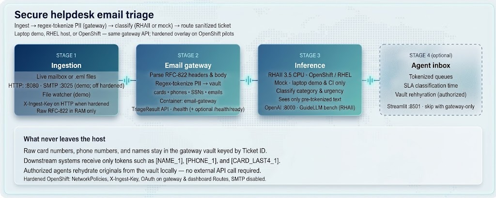
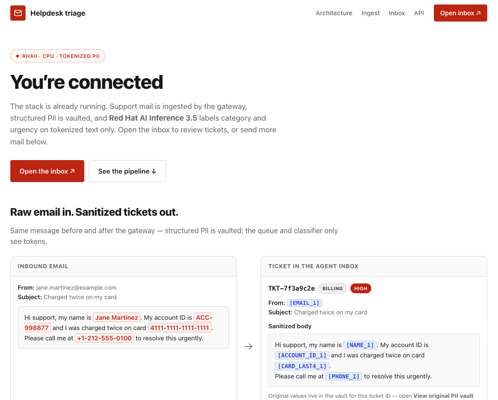
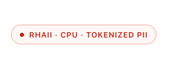
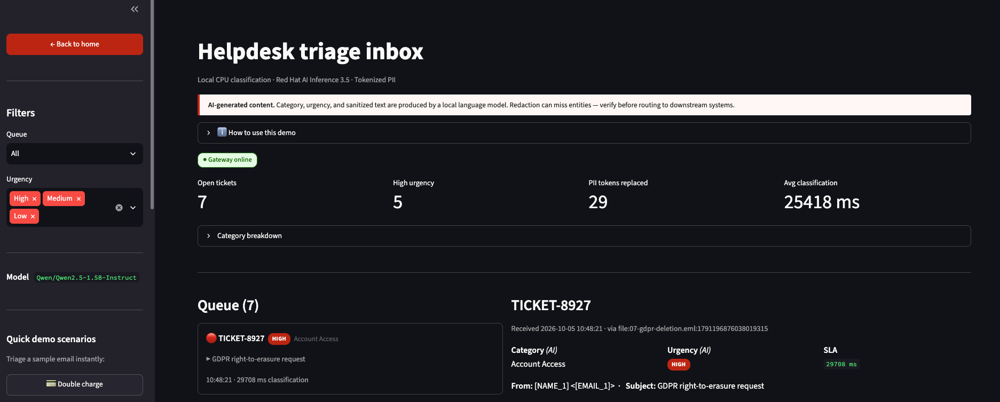
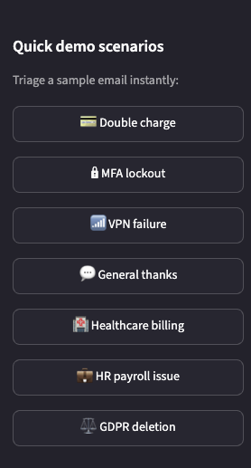
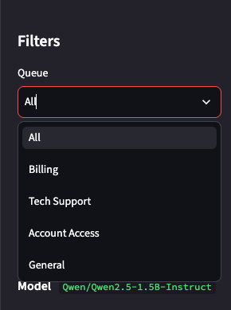
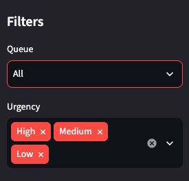
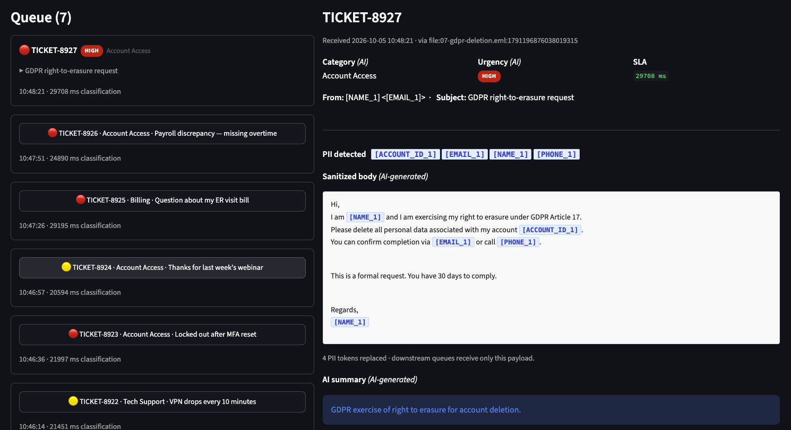
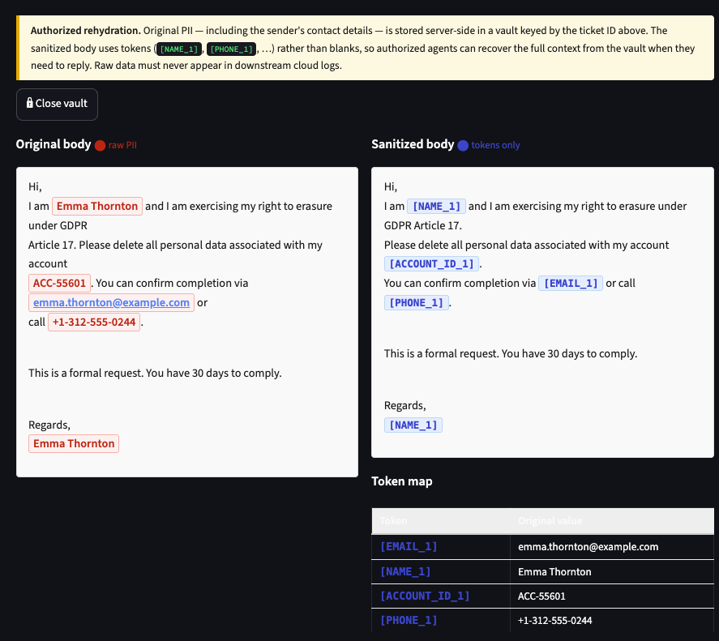
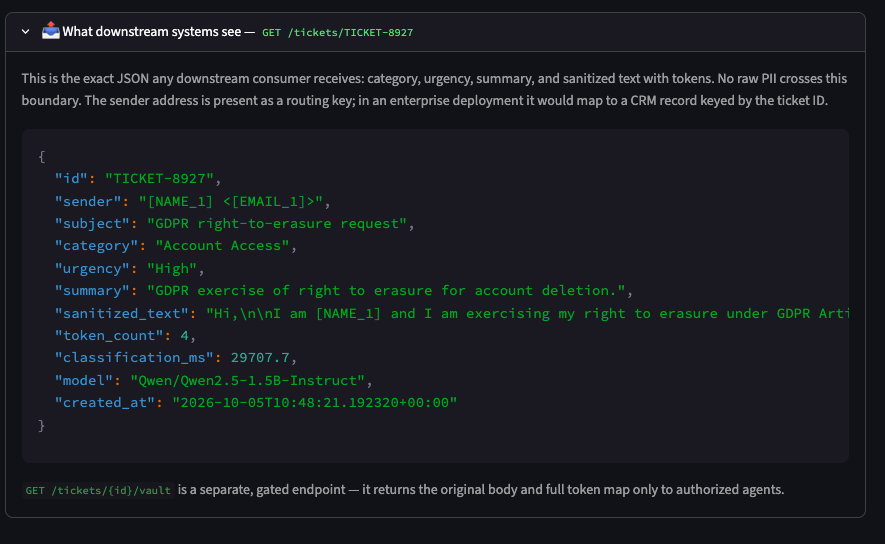

# Secure Local AI for Helpdesk Email Triage and PII Redaction

Securely classify helpdesk email by category and urgency with reversible PII tokenization and local RHAII 3.5 CPU inference on RHEL or OpenShift.

## Table of Contents

- [Overview](#overview)
  - [Who is this for?](#who-is-this-for)
  - [What this quickstart provides](#what-this-quickstart-provides)
  - [What you'll build](#what-youll-build)
  - [Architecture](#architecture)
- [Requirements](#requirements)
  - [Track 1: OpenShift requirements](#track-1-openshift-requirements)
  - [Track 2: RHEL requirements](#track-2-rhel-requirements)
- [Deploy](#deploy)
  - [Track 1: Deploy to OpenShift (RHAII CPU)](#track-1-deploy-to-openshift-rhaii-cpu)
    - [Prerequisites](#prerequisites)
    - [Step 1: Deploy with RHAII CPU](#step-1-deploy-with-rhaii-cpu)
    - [Step 2: Verify deployment](#step-2-verify-deployment)
    - [Submit support tickets](#submit-support-tickets)
    - [Review classified and redacted emails](#review-classified-and-redacted-emails)
    - [Review classification speed](#review-classification-speed)
    - [Testing classification and redaction quality](#testing-classification-and-redaction-quality)
    - [Load testing](#load-testing)
  - [Track 2: Run on RHEL with systemd (Quadlet)](#track-2-run-on-rhel-with-systemd-quadlet)
    - [Prerequisites](#prerequisites-1)
    - [Step 1: One-time setup (repo root)](#step-1-one-time-setup-repo-root)
    - [Step 2: Build and start (ordered — avoids heuristic fallback)](#step-2-build-and-start-ordered--avoids-heuristic-fallback)
    - [Step 3: Verify](#step-3-verify)
    - [Step 4: Hands-on validation (same checklist as Track 1)](#step-4-hands-on-validation-same-checklist-as-track-1)
    - [Step 5 (optional): Benchmark inference with GuideLLM](#step-5-optional-benchmark-inference-with-guidellm)
    - [Stop](#stop)
  - [What you've accomplished](#what-youve-accomplished)
  - [Delete](#delete)
- [Reference](#reference)
- [Technical Details](#technical-details)
  - [Documentation](#documentation)
- [Tags](#tags)

## Overview

Modern enterprises handle thousands of unstructured data streams every day, including customer support emails, contact forms, and IT helpdesk requests. Before these requests can be processed or routed, compliance teams need to ensure that Personally Identifiable Information (PII)—such as credit card numbers, phone numbers, account identifiers, and full names—is securely sanitized to support regulatory requirements such as GDPR, HIPAA, and GLBA. Traditionally, addressing this challenge could mean routing sensitive data to external cloud APIs, increasing data-leakage risk, or provisioning high-performance GPU servers that are expensive and often supply-constrained.

This quickstart demonstrates how to use CPU-based AI inference on existing RHEL or OpenShift infrastructure to run a lightweight, stateless classification and redaction service locally. It focuses on customer support email triage—classifying requests by category and urgency while sanitizing PII—but the same pattern can extend to CRM records, ticketing systems, contact forms, and webhook-based workflows. GuideLLM benchmarking helps teams measure throughput and latency on standard CPU hardware, providing data to assess pilot capacity and support-response SLAs.

### Who is this for?

**Business and support operations teams** can use the example to assess whether locally hosted AI fits their email triage workflow. It shows how to categorize and prioritize requests, tokenize detected PII before model inference, and measure CPU performance before planning a pilot.

**Platform engineers, AI engineers, and architects** can use this quickstart to run **[Red Hat AI Inference (RHAII) 3.5](https://docs.redhat.com/en/documentation/red_hat_ai_inference/3.5/html/getting_started/about-cpu-inference_getting-started)** on OpenShift or RHEL. You’ll run an instruction-tuned model on **x86_64 with AVX512** (no GPU), connect an app to its OpenAI-compatible endpoint, check readiness and latency, and optionally benchmark it with GuideLLM.

### What this quickstart provides

This quickstart has two main components:

- An email gateway that ingests messages, tokenizes detected PII before classification, and returns a ticket result through its API. It can also send results to a configured downstream webhook.
- An optional Streamlit UI where support agents can review classified tickets, filter by category and urgency, preview downstream JSON, and rehydrate tokenized values when authorized.

Organizations can integrate the gateway API or reuse parts of the gateway in their existing systems. The Streamlit UI provides a way to review the workflow during evaluation.

### What you'll build

The quickstart supports two tracks:

* [Track 1](#track-1-deploy-to-openshift-rhaii-cpu) deploys the stack to OpenShift.
* [Track 2](#track-2-run-on-rhel-with-systemd-quadlet) runs on RHEL with systemd and Quadlet.

Both use RHAII 3.5 CPU and follow the same email triage workflow; choose the track that matches your environment.

After either track, you’ll have built and deployed:

- A running email gateway that accepts messages over HTTP, SMTP (demo), or `.eml` file drops
- A gateway configured to replace detected PII with regex tokens and store the original values in a per-ticket vault
- Classification configured to assign each ticket a category and urgency
- An optional Streamlit inbox for reviewing tickets, filtering the queue, previewing downstream JSON, and rehydrating original values when authorized
- An optional GuideLLM runner for benchmarking CPU inference on OpenShift or RHEL

### Architecture



1. **Ingest** — HTTP, SMTP, or file watcher on `.eml` drops.
2. **Gateway** — Tokenizes structured PII into a vault; exposes `TriageResult` JSON and `/health/ready`.
3. **Inference** — Classification on **RHAII 3.5 CPU** on tokenized text only.
4. **Agent inbox** *(optional)* — Streamlit UI to review redaction and classificaiton

## Requirements

Both tracks run RHAII 3.5 CPU inference; no GPU is required.

### Track 1: OpenShift requirements

#### Hardware

- x86_64 inference worker with AVX512
- At least 4 vCPUs available to inference (8 recommended)
- At least 16 GiB allocatable RAM on the inference node (32 GiB recommended)
- 20 GiB `rhaii-model-cache` PVC for model weights

#### Software

- OpenShift Container Platform 4.14 or later ([Red Hat supported environments](https://docs.redhat.com/en/documentation/red_hat_ai/3/html/supported_product_and_hardware_configurations/rhaiis-supported-deployment-environments_supported-configurations))
- [`oc` CLI matching the cluster version](https://console.redhat.com/openshift/downloads)
- [Kustomize 5.8.1](https://github.com/kubernetes-sigs/kustomize/blob/master/site/content/en/docs/Getting%20started/installation.md)
- [Python 3.12](https://www.python.org/downloads/release/python-31214/)
- [Git](https://git-scm.com/downloads), [GNU Make](https://www.gnu.org/software/make/#download), [curl](https://curl.se/download.html), and [Podman](https://podman.io/docs/installation)

#### Permissions

- Namespace admin (or equivalent) permissions for Routes, Deployments, Secrets, and PVCs
- Access to a Red Hat account authorized to pull the RHAII image from `registry.redhat.io`
- Hugging Face token

### Track 2: RHEL requirements

#### Hardware

- x86_64 CPU with AVX512
- At least 4 vCPUs available to inference (8 recommended)
- At least 16 GiB system RAM (32 GiB recommended)
- 20 GiB for model weights in `~/rhaii-cache` or the path configured in the Quadlet unit

#### Software

- [RHEL 9.4+ (including RHEL 10)](https://developers.redhat.com/products/rhel/download), rootless [Podman 4.9 or later](https://podman.io/docs/installation), [Git](https://git-scm.com/downloads), and [GNU Make](https://www.gnu.org/software/make/#download).

#### Permissions

- Permission to use user systemd (`systemctl --user`)
- Access to a Red Hat account authorized to pull the RHAII image from `registry.redhat.io`
- Hugging Face token

## Deploy

### Track 1: Deploy to OpenShift (RHAII CPU)

*~30–45 minutes.

#### Prerequisites

- `oc` logged into a cluster that meets the [Track 1 hardware requirements](#track-1-openshift-requirements)
- `git`, `make`, `curl`, `python3`, and Kustomize 5.8.1
- `export HF_TOKEN="your_huggingface_token"`
- `podman login registry.redhat.io`

#### Step 1: Deploy with RHAII CPU

```bash
git clone <repo-url> && cd helpdesk-email-triage
oc new-project helpdesk-email-triage 
export HF_TOKEN="your_huggingface_token"
podman login registry.redhat.io
INFERENCE=rhaii make deploy-openshift
```

Weights download to the `rhaii-model-cache` PVC on first start. Increase wait if needed: `RHAII_WAIT_TIMEOUT=1200s INFERENCE=rhaii make deploy-openshift`.

Example output from running `INFERENCE=rhaii make deploy-openshift` (lines starting with `$` are commands; the rest is script output):

```console
$ INFERENCE=rhaii make deploy-openshift
chmod +x scripts/deploy-openshift.sh scripts/openshift-rhaii-secrets.sh scripts/openshift-verify.sh
INFERENCE="${INFERENCE:-rhaii}" ./scripts/deploy-openshift.sh
==> Checking cluster capacity for RHAII CPU (requests: 4 CPU, 8Gi memory)
    Found node(s) with >=16Gi allocatable memory
==> Preparing RHAII CPU secrets (registry.redhat.io + Hugging Face)
secret/hf-secret created
==> Applying deploy/openshift/overlays/helpdesk-email-triage-rhaii (inference=rhaii, image-tag=latest)
serviceaccount/helpdesk-route-reader created
role.rbac.authorization.k8s.io/helpdesk-route-reader created
rolebinding.rbac.authorization.k8s.io/helpdesk-route-reader created
configmap/helpdesk-config created
configmap/helpdesk-routes created
configmap/sample-emails-k5hg95fhmb created
secret/helpdesk-secrets created
service/agent-dashboard created
service/email-gateway created
service/rhaii-cpu created
persistentvolumeclaim/gateway-data created
persistentvolumeclaim/rhaii-model-cache created
deployment.apps/agent-dashboard created
deployment.apps/email-gateway created
deployment.apps/rhaii-cpu created
networkpolicy.networking.k8s.io/allow-dashboard-to-gateway created
networkpolicy.networking.k8s.io/allow-gateway-to-inference created
networkpolicy.networking.k8s.io/allow-openshift-ingress created
networkpolicy.networking.k8s.io/default-deny-ingress created
route.route.openshift.io/agent-dashboard created
route.route.openshift.io/email-gateway created
configmap/helpdesk-deploy-info created
==> Waiting for deployments
deployment.apps/rhaii-cpu condition met
deployment.apps/email-gateway condition met
deployment.apps/agent-dashboard condition met

Deployed to namespace: helpdesk-email-triage (inference: rhaii)
NAME                                   READY   STATUS    RESTARTS   AGE
pod/agent-dashboard-7b8497dbfd-swpxh   1/1     Running   0          4m13s
pod/email-gateway-5549f756c4-k6jwq     1/1     Running   0          4m13s
pod/rhaii-cpu-964f6d545-wsfh5          1/1     Running   0          4m12s

NAME                                       HOST/PORT                                                                                   PATH   SERVICES          PORT   TERMINATION     WILDCARD
route.route.openshift.io/agent-dashboard   agent-dashboard-helpdesk-email-triage.<cluster>          agent-dashboard   http   edge/Redirect   None
route.route.openshift.io/email-gateway     email-gateway-helpdesk-email-triage.<cluster>            email-gateway     http   edge/Redirect   None

Gateway:   https://email-gateway-helpdesk-email-triage.apps.<cluster>/health
Dashboard: https://agent-dashboard-helpdesk-email-triage.apps.<cluster>/welcome   (inbox: https://agent-dashboard-helpdesk-email-triage.apps.<cluster>/inbox/)
Inference: RHAII CPU (registry.redhat.io/rhaii/vllm-cpu-rhel9) — first start may take several minutes
```

In the sample above, `<cluster>` stands in for your cluster apps domain (for example `apps.cluster.example.com`). Hostnames from `oc get route` include that full suffix.

Open `https://<dashboard-route>/welcome`.


#### Step 2: Verify deployment

```bash
$ make verify-openshift
```

Example output (`$` = command you ran; following lines = script output):

```console
$ make verify-openshift
chmod +x scripts/openshift-verify.sh
./scripts/openshift-verify.sh
Namespace: helpdesk-email-triage
Gateway:   https://email-gateway-helpdesk-email-triage.<cluster>/health
Dashboard: https://agent-dashboard-helpdesk-email-triage.<cluster>/welcome   (inbox: https://agent-dashboard-helpdesk-email-triage.<cluster>/inbox/)

## Verify
curl -sk "https://email-gateway-helpdesk-email-triage.<cluster>/health"   # may show OAuth page when hardened
curl -skI "https://agent-dashboard-helpdesk-email-triage.<cluster>" | head -5
Open: https://agent-dashboard-helpdesk-email-triage.<cluster>/welcome

==> Gateway health (API base: https://email-gateway-helpdesk-email-triage.<cluster>)
{"status":"ok","classify_model":"Qwen/Qwen2.5-1.5B-Instruct"}

==> Dashboard /welcome
OK — onboarding page reachable

==> Dashboard headers (/)
HTTP/1.1 302 Moved Temporarily
server: nginx/1.20.1
date: Mon, 05 Oct 2026 10:58:53 GMT
content-type: text/html
content-length: 145

==> Waiting for ticket (file watcher on sample_emails/)
==> Found 7 ticket(s) from file watcher
```

You should see **Gateway** and **Dashboard** Route URLs, gateway `/health` JSON (with a real model name when RHAII is up), dashboard headers, and at least one ticket.

Open **`https://<dashboard-route>/welcome`** — the pill should show **RHAII**.



Click on `Open the inbox` in the welcome page (`https://<dashboard-route>/welcome`)
to open the main dashboard.


The main dashboard will look as follows:



Save your **dashboard** URL (`https://<dashboard-route>/welcome`) and **gateway** URL (`https://<gateway-route-host>`) for the steps below.

#### Submit support tickets

**TODO**: add more specific step by step instructions with screenshots and explanation of what you see.

Try each ingest path at least once on the cluster:

| Method | How |
|---|---|
| **File watcher** | Sample `.eml` files in `sample_emails/` if mounted. Ingest all .eml files on deploy and add new/changed files at runtime |
| **Sidebar scenarios** | On the dashboard Route → **Quick demo scenario** (billing, MFA, VPN, …) |
| **Custom message** | Sidebar form → **Triage →** |
| **HTTP API** | `POST /ingest/raw` or upload `.eml` via `POST /ingest` ([integration.md](docs/integration.md)) |
| **SMTP** | Sidebar **↪** or mail to `support@helpdesk.local` when SMTP is exposed on the overlay |

The **Quick demo scenario** buttons are in the left-hand sidebar:



```bash
export GW="https://$(oc get route email-gateway -n helpdesk-email-triage -o jsonpath='{.spec.host}')"
curl -sk -X POST "${GW}/ingest/raw" \
  -H "Content-Type: application/json" \
  -d '{"sender":"you@example.com","subject":"VPN issue","body":"Cannot connect from home office."}'
```

If sample\_emails are mounted the app will rescan for new/changed files and ingest them. Note that there is NO LOCKING during the rescan. Any new files must be put with an extension different from `.eml` first and renamed to a `.eml` file to be picked up by the app.

**What to look for:** New tickets in the inbox queue within a few seconds.

#### Review classified and redacted emails

##### Step 1: Review the email in the different inboxes based on classification

1. On the dashboard, set **Queue** to each category: `Billing`, `Tech Support`, `Account Access`, `General`, then `All`.

   

2. Set **Urgency** to `High` — urgent samples (double charge, MFA lockout) should surface first.

   

3. Click tickets in the left **Queue** column; detail opens with **category**, **urgency**, and subject.
4. Expand **Category breakdown** above the queue.

Expected sample results (file-watcher emails):

| Email | Category | Urgency |
|---|---|---|
| Double charge on card | Billing | High |
| MFA lockout | Account Access | High |
| VPN dropping | Tech Support | Medium |
| GDPR erasure request | General | Low |

##### Step 2: Check redaction

1. Open a ticket with obvious PII (e.g. billing double-charge).
2. In **Sanitized body**, confirm tokens (`[NAME_1]`, `[EMAIL_1]`, `[CARD_LAST4_1]`, `[PHONE_1]`, `[ACCOUNT_ID_1]` for `ACC-…`) — not raw values. **From** on the ticket should be tokenized.

   

3. Click **View original PII vault** — compare the token map to the original body.

   

4. Expand **What downstream systems see** — exact `GET /tickets/{id}` JSON for webhooks/CRMs; no `original_text` or vault map.

   

#### Review classification speed

1. In the queue list, each ticket shows its **classification time**.
2. At the top of the inbox, check **Avg classification** in the metrics row.
3. In ticket detail, note the per-ticket latency tag next to the timestamp.

```bash
export GW="https://$(oc get route email-gateway -n helpdesk-email-triage -o jsonpath='{.spec.host}')"
curl -sk "${GW}/tickets" | python3 -c \
  'import json,sys; t=json.load(sys.stdin); print([(x["id"], x.get("classification_ms")) for x in t[:5]])'
```

For example in one of our tests we saw:

```bash
curl -sk -X POST "${GW}/ingest/raw"   -H "Content-Type: application/json"   -d '{"sender":"you@example.com","subject":"VPN issue","body":"Cannot connect from home office."}'
{"id":"TICKET-8930","sender":"[EMAIL_1]","subject":"VPN issue","sanitized_text":"Cannot connect from [WORK_LOCATION]","summary":"User cannot connect from their work location.","category":"Tech Support","urgency":"High","classification_ms":4664.3,"source":"api","model":"Qwen/Qwen2.5-1.5B-Instruct","created_at":"2026-09-30T18:09:37.280911+00:00","token_count":1}
```

Which shows a classification time of 4664.3 milliseconds. This seems resonable for a non-realtime communication channel like email.

#### Testing classification and redaction quality

**TODO**: Expand these into more step by step instructions with screenshots. Include explanations of interesting things to note/see.

1. **Custom PII patterns** — submit a message with a card number, phone, email, and `ACC-12345` account id; verify distinct tokens in the sanitized body and vault map.
2. **Category sanity** — billing language → `Billing`; access/MFA → `Account Access`; VPN/outage → `Tech Support`.
3. **Residual names** — RHAII may add `[NAME_N]` tokens; the gateway merge step rejects model output that drops structured tokens or reintroduces raw PII.
4. **Heuristic fallback** — scale inference to zero (`oc scale deployment/rhaii-cpu -n helpdesk-email-triage --replicas=0`); ingest still works and `model` shows `heuristic-fallback`. Scale back up when finished.
5. **Regression** — run `make test` on a workstation for automated API and pipeline checks.

At this point you can explore the sumbmission channels and the results in the UI before continuing on to load testing.

#### Load testing

In this step you will use [GuideLLM](https://github.com/vllm-project/guidellm) to send synthetic requests to the OpenAI-compatible RHAII inference endpoint. This measures inference throughput and latency; it does not load-test the gateway.

##### Step 1: Prepare registry access

The benchmark Job uses the Red Hat GuideLLM image. It can use the same `registry.redhat.io` pull secret as RHAII CPU. If the namespace does not already have usable registry credentials, log in from your workstation so the deployment script can create the pull secret:

```bash
podman login registry.redhat.io
```

##### Step 2: Run the benchmark

First deploy the quickstart to your OpenShift project with RHAII CPU inference enabled if you have not done so already. 
Next run the guidellm-openshift target

```bash
make guidellm-openshift
```

The Job sends requests to the in-cluster Service (`rhaii-cpu:8000`) to test the deployment. You can
what the progress as the load test progresses with:

```bash
oc logs -n helpdesk-email-triage job/guidellm-benchmark-<timestamp> --follow
```

For more details on how to load test inference with GuideLLM see [the OpenShift benchmark runbook](docs/deploy-openshift.md#load-test-inference-guidellm).

##### Step 3: Review results


**TODO**: make this more step by step with instructions, and screenshots or example of the results, highlighting how to find
what is interesting

- **Console** — throughput and latency in the Job logs (`oc logs …`).
- **HTML** — open `./results/guidellm-openshift/*.html` in a browser.
- **JSON** — archive or compare runs under `./results/guidellm-openshift/`.

Use the results to size RHAII CPU nodes before a pilot.

---

### Track 2: Run on RHEL with systemd (Quadlet)

*~45 minutes. **Recommended for single-host evaluation** — RHAII 3.5 CPU via user systemd, with optional [GuideLLM benchmarking](#step-5-optional-benchmark-inference-with-guidellm).*

#### Prerequisites

- RHEL 9.4+ (including **RHEL 10**) with rootless Podman meeting the [Track 2 hardware requirements](#track-2-rhel-requirements)
- **Packages** on minimal hosts: `sudo dnf install -y podman git make` — **no Compose** required for this track
- **Secrets file** — Quadlet containers read **`~/.config/helpdesk/secrets.env` only** (exporting `HF_TOKEN` in your shell does not configure the engine). Set a real `HUGGING_FACE_HUB_TOKEN` and a strong `VAULT_SECRET` before start. Optional `INGEST_API_KEY` gates HTTP ingest when set. Placeholder override: `QUADLET_ALLOW_PLACEHOLDER_SECRETS=1` — [deploy/quadlet/README.md](deploy/quadlet/README.md#secretsenv-and-quadlet_allow_placeholder_secrets)

```bash
podman login registry.redhat.io
sudo dnf install -y podman git make python-pip
pip install podman-compose
```

#### Step 1: One-time setup (repo root)

```bash
git clone <repo-url> && cd helpdesk-email-triage
make quadlet-setup
```

`make quadlet-setup` creates directories, copies sample mail and docs into `~/helpdesk/`, installs Quadlet units under `~/.config/containers/systemd/`, and creates `~/.config/helpdesk/secrets.env` **only if it does not exist**.

**Edit secrets before RHAII start** (replace with your token path or paste a token):

```bash
cat > ~/.config/helpdesk/secrets.env <<EOF
HUGGING_FACE_HUB_TOKEN=$(cat ~/hf_token)
VAULT_SECRET=$(openssl rand -hex 32)
EOF
chmod 600 ~/.config/helpdesk/secrets.env
podman login registry.redhat.io
```

Do not leave `hf_your_token_here` or `change-me-before-deploy` in that file.

#### Step 2: Build and start (ordered — avoids heuristic fallback)

`make quadlet-deploy` builds gateway/UI images, starts inference, **waits until `/v1/models` and gateway `/health/ready`**, then starts the gateway and dashboard and ingests sample mail.

```bash
make quadlet-deploy
```

Do **not** start all three services in one command (`systemctl --user start rhaii-cpu-engine email-gateway …`) on a cold host: the gateway file-watcher ingests sample `.eml` while vLLM is still loading, and those tickets are stored with model **`heuristic-fallback`** even after inference is healthy.

<details>
<summary>Manual equivalent (advanced)</summary>

```bash
make quadlet-build
cp deploy/quadlet/*.container deploy/quadlet/*.network deploy/quadlet/*.volume \
   ~/.config/containers/systemd/
systemctl --user daemon-reload
make quadlet-up
```

`make quadlet-up` performs the same inference and readiness waits as `quadlet-deploy`. Skip sample ingest: `SKIP_INGEST=1 make quadlet-up`.
</details>

Quadlet units show as **`generated`** in `systemctl --user list-unit-files`. For boot / after SSH logout:

```bash
sudo loginctl enable-linger "$USER"
systemctl --user add-wants default.target \
  rhaii-cpu-engine.service email-gateway.service agent-dashboard.service
```

Watch RHAII come up (first start downloads weights). If `journalctl --user` prints **No journal files were found**, use **Podman logs** (always works) or enable linger and open a new SSH session:

```bash
podman logs -f rhaii-cpu-engine
# or, once user journal exists:
journalctl --user -u rhaii-cpu-engine.service -f
```

#### Step 3: Verify

```bash
make quadlet-verify
# or:
systemctl --user status rhaii-cpu-engine email-gateway agent-dashboard
curl -sS http://127.0.0.1:8080/health          # classify_model: Qwen/Qwen2.5-1.5B-Instruct
curl -sS http://127.0.0.1:8080/health/ready    # must succeed before trusting classifications
curl -sS http://127.0.0.1:8080/tickets | python3 -m json.tool | head -20
curl -sI http://127.0.0.1:8501/welcome | head -5
```

Open **[http://127.0.0.1:8501/welcome](http://127.0.0.1:8501/welcome)** — the pill should show **RHAII**. On the inbox, **Model** in the sidebar reflects the **first ticket** in the queue; triage a new **Quick demo scenario** if older tickets still say `heuristic-fallback` from a cold start.

From a laptop, SSH port-forward: `ssh -L 8501:127.0.0.1:8501 -L 8080:127.0.0.1:8080 ec2-user@<host>`.

**Troubleshooting:** `make guidellm-quadlet` asks for `HF_TOKEN` / `HUGGING_FACE_HUB_TOKEN` → put a real token in `~/.config/helpdesk/secrets.env` (not `hf_your_token_here`). `curl …/health/ready` failing → fix `rhaii-cpu-engine` (`podman logs rhaii-cpu-engine --tail 80`): `HUGGING_FACE_HUB_TOKEN` in `secrets.env`, registry login, **≥16 GiB RAM**. **`/health` shows `"classify_model":""` or `/welcome` does not show RHAII** on a host deployed before a repo update → re-copy `deploy/quadlet/email-gateway.container` to `~/.config/containers/systemd/`, then `systemctl --user daemon-reload && systemctl --user restart email-gateway` (the unit sets `MODEL_NAME` for the welcome pill). Sidebar **Model `heuristic-fallback`** with healthy inference → stale tickets from early ingest; triage a new scenario or stop the gateway, `podman volume rm gateway-data`, and `make quadlet-up` again. After other Quadlet unit changes, same `cp` / `daemon-reload` / restart pattern. Details: [deploy/quadlet/README.md](deploy/quadlet/README.md).

#### Step 4: Hands-on validation (same checklist as Track 1)

Use the **[Track 1 validation steps](#submit-support-tickets)** on this host, substituting these RHEL endpoints for OpenShift Routes:

| | RHEL / Quadlet |
|---|---|
| **Welcome / inbox** | `http://127.0.0.1:8501/welcome` |
| **Gateway API** | `http://127.0.0.1:8080` |
| **Vault secret** | `VAULT_SECRET` in `~/.config/helpdesk/secrets.env` |
| **GuideLLM** | `make guidellm-quadlet` (inference on `http://127.0.0.1:8000`) — [Step 5](#step-5-optional-benchmark-inference-with-guidellm) |

Optional extra ingest:

```bash
./scripts/ingest-sample.sh
```

#### Step 5 (optional): Benchmark inference with GuideLLM

Use GuideLLM to measure throughput and latency at the RHAII inference endpoint. Before benchmarking, make sure the Quadlet stack is up and `curl -sf http://127.0.0.1:8080/health/ready` succeeds from the repository root. GuideLLM loads the Hugging Face tokenizer, so set a real **`HUGGING_FACE_HUB_TOKEN`** in `~/.config/helpdesk/secrets.env`; a shell `export` alone is not enough.

For end-to-end **gateway** load, send parallel `POST /ingest/raw` requests to `http://127.0.0.1:8080`. Include `X-Ingest-Key` when configured.

##### Pull the GuideLLM image

If you have not already logged in during setup, authenticate to the Red Hat registry and pull the benchmark image:

```bash
podman login registry.redhat.io
podman pull registry.redhat.io/rhai/guidellm-rhel9:3.5.0-1787154406
```

##### Run the benchmark

By default, the benchmark targets RHAII at `http://127.0.0.1:8000`:

```bash
make guidellm-quadlet
# Optional: GUIDELLM_RATE=1,2,4 GUIDELLM_MAX_SECONDS=300 make guidellm-quadlet
```

To target RHAII over the Podman network instead, run:

```bash
GUIDELLM_PODMAN_NETWORK=helpdesk GUIDELLM_TARGET=http://rhaii-cpu-engine:8000 make guidellm-quadlet
```

The benchmark uses the Red Hat image with the `guidellm run` command. It writes console output plus HTML and JSON results under `./results/guidellm-quadlet/`; open `benchmark-results.html` to review the report. Use the results to assess CPU capacity for a pilot.

#### Stop

```bash
make quadlet-down
# or: systemctl --user stop agent-dashboard email-gateway rhaii-cpu-engine
```

**Compose alternative** on RHEL (no systemd): see [Production RHEL with Compose](#production-rhel-with-compose) below. Full Quadlet notes: [deploy/quadlet/README.md](deploy/quadlet/README.md).

### What you've accomplished

- Deployed a **helpdesk triage pipeline** on OpenShift or RHEL (ingest → tokenize → RHAII classify → ticket API).
- Submitted mail via **multiple ingest paths** and confirmed tickets in the optional Streamlit inbox.
- Verified **category and urgency** and filtered the queue by classification.
- Confirmed **PII redaction** (including sender and `ACC-…` account ids) in downstream JSON while retaining authorized vault rehydration.
- Observed **classification latency** per ticket and in aggregate.
- Optionally **benchmarked inference** with GuideLLM on RHAII CPU.

### Delete

For OpenShift:

```bash
make undeploy-openshift
```

If you want to delete the namespace at the same time you can add DELETE_NAMESPACE=1:
```
# Remove the whole project:
DELETE_NAMESPACE=1 make undeploy-openshift
```

For local Compose or RHEL Compose deployments, run `make down` to stop the containers and remove their Compose volumes. For RHEL with Quadlet, run `make quadlet-down`; it stops the services and keeps the Quadlet units and data volumes. Full OpenShift overlay catalog: [docs/deploy-openshift.md](docs/deploy-openshift.md).

---

## Reference

- [Red Hat AI Inference 3.5 — CPU inference](https://docs.redhat.com/en/documentation/red_hat_ai_inference/3.5/html/getting_started/about-cpu-inference_getting-started)
- [AI quickstart catalog](https://docs.redhat.com/en/learn/ai-quickstarts)
- [Qwen2.5-1.5B-Instruct](https://huggingface.co/Qwen/Qwen2.5-1.5B-Instruct)
- [GuideLLM](https://github.com/vllm-project/guidellm)


## Technical Details
### Documentation

| Guide | When to read it |
|---|---|
| [docs/quickstart-walkthrough.md](docs/quickstart-walkthrough.md) | Mirror of Track 1 hands-on sections for deep links |
| [docs/testing-locally.md](docs/testing-locally.md) | Every demo UI feature |
| [docs/integration.md](docs/integration.md) | HTTP/SMTP API, auth, webhooks |
| [docs/deploy-openshift.md](docs/deploy-openshift.md) | Overlays, verify, production checklist |
| [docs/customer-ci.md](docs/customer-ci.md) | Fork, Quay publish, pipeline adoption |
| [deploy/openshift/README.md](deploy/openshift/README.md) | Kustomize layout |
| [deploy/quadlet/README.md](deploy/quadlet/README.md) | Quadlet units |
| [docs/testing/README.md](docs/testing/README.md) | Functional / E2E regression (maintainers; GuideLLM stays in this README) |
| [CONTRIBUTING.md](CONTRIBUTING.md) | `make test`, CI, and contributor workflows |

---

## Tags

- **Title:** Triage support emails while protecting sensitive data
- **Description:** Classify support emails and redact PII locally, helping teams protect sensitive data while streamlining helpdesk triage.
- **Industry:** Information technology
- **Product:** Red Hat AI Inteference 
- **Use case:** Helpdesk email triage and PII redaction
- **Contributor org:** Red Hat
